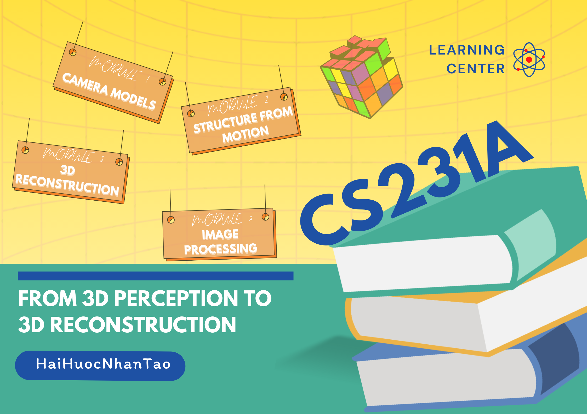

# HÀNH TRÌNH KHÁM PHÁ THỊ GIÁC MÁY TÍNH CÙNG CS231A

Xin chào mọi người! 

Hôm nay, mình quyết định bắt đầu một hành trình mới - học khóa CS231A (Computer Vision & 3D Geometry) của Stanford và sẽ chia sẻ toàn bộ quá trình học tập của mình tại đây.

## 🔍 Tại sao lại là CS231A?

Computer Vision (Thị giác máy tính) đang là một trong những lĩnh vực hấp dẫn nhất của AI/ML hiện nay. Từ nhận diện khuôn mặt, xe tự hành đến các ứng dụng AR/VR - tất cả đều cần một nền tảng vững chắc về toán học và thuật toán xử lý ảnh. CS231A chính là khóa học sẽ giúp chúng ta xây dựng nền tảng đó.

## 📚 Nội dung khóa học

- Camera Geometry: Hiểu về cách máy ảnh "nhìn" thế giới
- Structure from Motion: Khôi phục cấu trúc 3D từ các bức ảnh 2D
- 3D Vision: Các kỹ thuật xử lý và tái tạo môi trường 3D
- Ứng dụng thực tế trong robotics, AR/VR và nhiều lĩnh vực khác

## 🎯 Mục tiêu của series

1. Chia sẻ kiến thức một cách dễ hiểu nhất
2. Thực hành qua các project thực tế
3. Xây dựng cộng đồng học tập cùng nhau

## ⏰ Lộ trình

- Mỗi tuần mình sẽ chia sẻ 2-3 bài về nội dung đã học
- Cuối mỗi module sẽ có project thực hành
- Tổng thời gian dự kiến: 12 tuần

## 📖 Tài liệu tham khảo chính

1. [Syllabus của khóa học](https://web.stanford.edu/class/cs231a/syllabus.html)
   - Đây là lộ trình chi tiết mình sẽ follow
   - Bao gồm các chủ đề từ cơ bản đến nâng cao
   - Timeline cụ thể cho từng module

2. [Course Notes](https://web.stanford.edu/class/cs231a/course_notes.html)
   - Tài liệu lý thuyết chính thức từ Stanford
   - Notes được cập nhật thường xuyên
   - Có nhiều ví dụ và hình ảnh minh họa

## 🤝 Đóng góp và Thảo luận

Mình mong muốn repository này không chỉ là hành trình học tập của riêng mình mà còn là nơi chúng ta cùng trao đổi, thảo luận và phát triển. Hãy tạo issue hoặc pull request nếu bạn muốn đóng góp nhé!

## 📝 Lưu ý

PS: Mình sẽ cố gắng làm cho nội dung dễ tiếp cận nhất có thể, kể cả khi bạn chưa có nhiều kiến thức về Computer Vision. Let's learn together! 🚀

#ComputerVision #CS231A #MachineLearning #TechLearning #Stanford